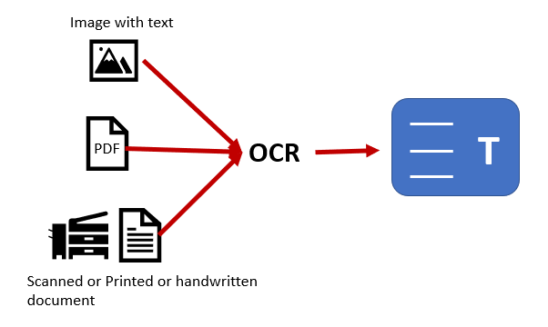
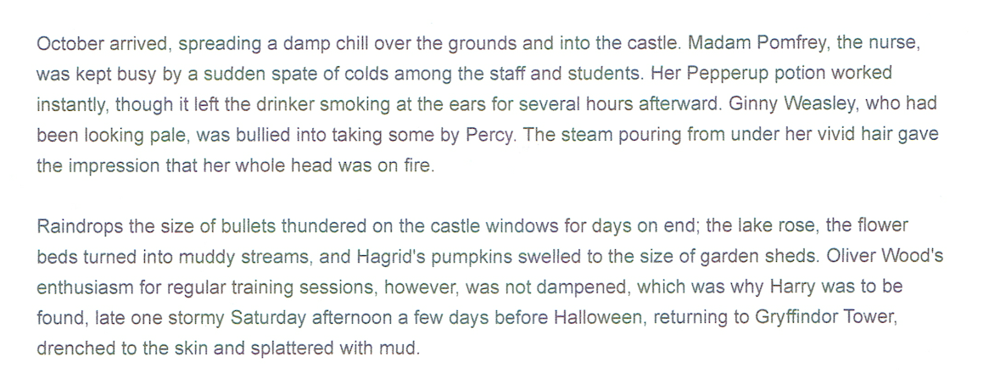
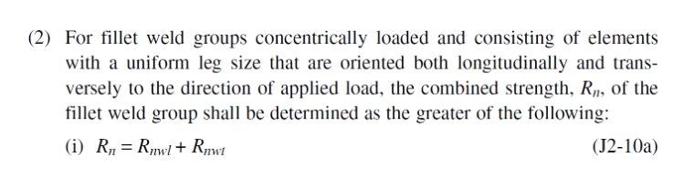

# OCR-Snipping-Converter
C# application that prompts a user to take a snipping of their screen and perform Optical Character Recognition (OCR) to convert the image to text.

## Description
The application creates a snipping tool that collects the sizes of all active monitors and prompts the user to draw a rectangular area for screenshotting purposes. This snipped image will be passed through an **Optical Character Recognition (OCR)** algorithm (utlizing the IronOCR library https://ironsoftware.com/csharp/ocr/) and return any text available to convert within the image.

## Background
This application was devloped as a solution for copying text from old scanned images of construction manuals. Many of these manuals only exist as poorly scanned copies and included statements that were required to be added to reports. Copying these statements were a hassle, so this tool was developed to prompt the user to snip a screenshot of the required text and run it through an Optical Character Recognition (OCR) algorithm and generate text that could be copied.

### Optical Character Recognition (OCR)
OCR is a technology to convert handwritten, typed, scanned text or text inside images to machine-readable text. OCR is used commonly in situations where we want to:
- Create automated workflows by digitizing PDF documents across different business units
- Eliminate manual data entry by digitizing printed documents like reading passports, invoices, bank statements, etc.
- Create secure access to sensitive information by digitizing Id cards, credit cards, etc.
- Digitize printed books like the Gutenberg project

  

### IronOCR API
To perform the image scan, this application uses the IronOCR API developed by IronSoftware (https://ironsoftware.com/csharp/ocr/). 

"IronOCR is unique in its ability to automatically detect and read text from imperfectly scanned images and PDF documents. The AutoOCR Class provides the simplest (though not always fastest) way to extract text from images and documents - because it will automatically correct and sharpen low resolution scans, remove background noise, skew, distortion and perspective as well as enhancing resolution & contrast."

## How to run
1. Click on the **Snip image on screen to convert to text** button
2. Press down mouse and draw a rectangular area to process. Release mouse click when required area has been covered.
3. Once done, the image will be shown on the HUI and the text will be processed and placed under the **Output** field

## Output Examples
Original Image             |  Output application with text
:-------------------------:|:-------------------------:
  |  
  |  
